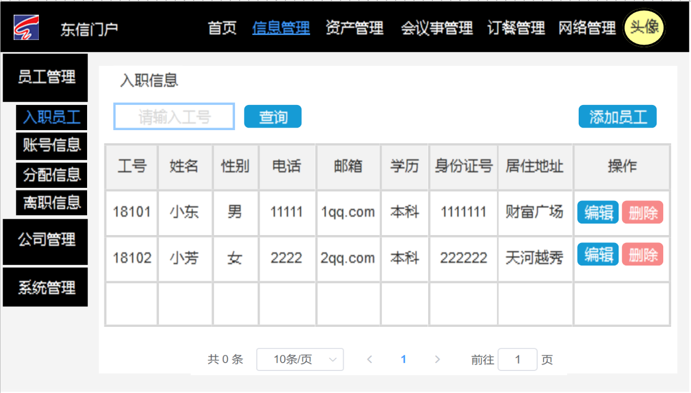
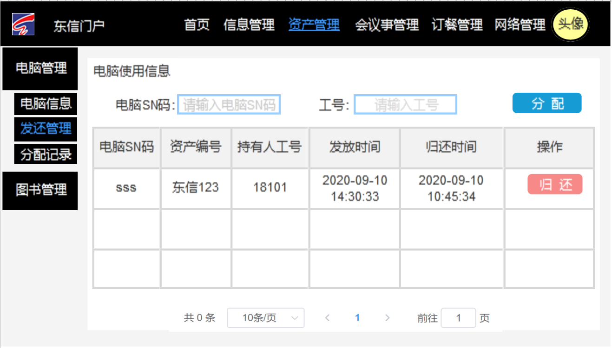
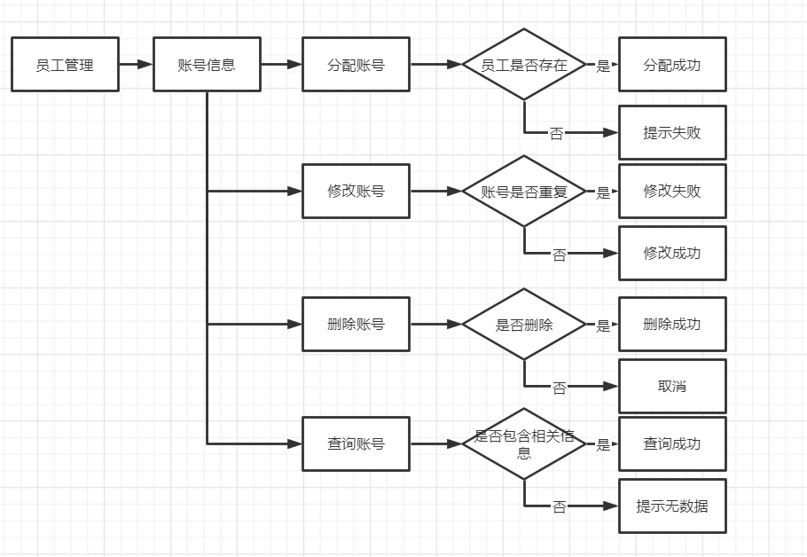
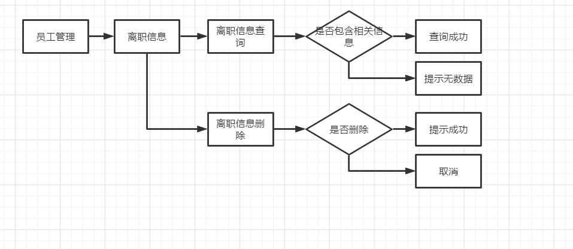

# eastcom-ripple项目设计

## 1. 项目介绍

### 1.1 项目背景

&emsp;&emsp;为了提高公司内部管理的效率，所以需要编制一套完整的用于公司内部管理的系统。这样一个系统可以在整个公司范围内使用，做到了公司资源的整合与分享。  

### 1.2 面向用户

&emsp;&emsp; **适用于公司内部员工、领导。**   

### 1.3 项目术语定义

- eastcom-com.eastcom.ripple：东信软件门户管理系统，指的是此项目的项目名

## 2. 需求分析

### 2.1 项目结构功能图

本系统的功能架构主要由管理员模块、视察员模块、员工模块、登录模块等功能模块组成，如下图所示。

**除了登录模块外，其他模块功能架构如下：**

1. **员工功能结构，如下图所示**

- 电脑：员工可以通过此功能查看自己所拥有的电脑信息
- 会议室：
  - 预定会议室：员工可以通过此功能进行查看某一天具体时间段的会议室信息，然后根据会议室的容量去选择，然后进行预定。
  - 审核中：可以查看自己预定了哪些会议室。
  - 已通过/未通过：可以看到自己哪些会议室申请成功了，哪些没申请成功。
  - 我的历史记录：可以查看自己以前申请过的会议室。
- 个人中心：员工可以查看个人信息，并可以对个别信息进行修改；并且还可以通过个人中心去修改密码。
- 点餐：员工可以通过此功能浏览商家以及食品，选择喜欢的可立即下单或加入购物车，还可以通过``我的订单``查看订单，或取消订单。通过购物车功能可以查看购物车的信息、移除购物车的食品、还可以清空购物车。
- 图书馆：
  - 图书信息：员工可以通过此功能查看图书信息，并选择感兴趣的，且数量不为0的书进行申请借用。
  - 申请列表：查看申请情况。
  - 我的历史记录：查看自己以前借的书。

2. **管理员功能结构，如下图所示**

- 信息管理：
  - 公司管理
    - 部门管理：管理员可以查看所有部门信息，并可以对相应的部门信息进行修改或删除操作、还可以添加部门信息。
    - 职位管理：管理员可以查看所有职位信息，并可以对相应的职位信息进行修改或删除操作、还可以添加职位信息。
  - 员工管理：
    - 管理员可以查看所有入职员工的信息，并可以对相应的员工信息进行修改、还可以添加员工信息，然后删除操作是相当于员工离职了，可以在离职员工信息表查看到。
    - 管理员可以通过员工分配信息这个功能可以对员工进行部门和职位的分配，且可根据部门/职位进行查询，还可以进行修改、删除操作。
    - 管理员可以通过员工账号信息为入职员工分配账号，可以根据关键词进行查询，还可以进行修改、删除操作。
    - 管理员可以查看所有离职员工的信息，还可以对离职员工的信息进行删除。
- 资产管理
  - 电脑管理：
    - 管理员可以查看电脑信息，并可以对相应的电脑信息进行修改或删除操作、还可以添加电脑信息。
    - 管理员可以通过电脑发还管理，对员工进行分配电脑或归还电脑操作。
    - 管理员可以查看电脑分配的历史纪录。
  - 图书馆管理：
    - 管理员可以查看图书信息，并可以对相应的图书信息进行修改或删除操作、还可以添加图书信息。
    - 管理员可以通过申请列表查看所有申请情况，然后对每个申请记录进行借用处理，然后就可以在借用情况中查看到记录。
    - 管理员可以在借用情况中查看图书的借用记录，并且可以对记录进行归还操作。
    - 管理员可以查看图书借用的历史纪录。
- 会议室管理：
  - 会议室列表：
    - 管理员可以通过此功能查看所有会议室信息，并可以对相应的会议室信息进行修改或删除操作、还可以添加会议室信息。
  - 申请列表：
    - 未审批：管理员通过此功能可以查看到有哪些预定的记录，然后对那些记录进行审批，审批完后可以在已审批看到。
    - 已审批：可查看到那些审批过的申请记录。
  - 历史记录：
    - 查看所有会议室历史预定记录信息。
    - 可查看每个员工预定会议室的次数。
- 点餐平台：
  - 商家管理：
    - 管理员可以查看商家信息，并可以对相应的商家信息进行修改或删除操作、还可以添加商家信息。
  - 食品类别管理：
    - 管理员可以查看食品类别信息，并可以对相应的食品类别信息进行修改或删除操作、还可以添加食品类别信息。
  - 食品管理:
    - 管理员可以查看食品信息，并可以对相应的食品信息进行修改或删除操作、还可以添加食品信息。
  - 订单管理：
    - 管理员可以查看所有的订单信息。并进行导出成execl文件，可以导出全部，也可以根据筛选条件进行导出。
- 网络管理：
  - IP管理：
    - 电脑常用IP信息：可以查看每一台电脑对应的常用IP信息。
    - IP信息：可以查看每一台电脑所有的IP信息。

3. **视察员功能结构，如下图所示**

- 视察员可以查看上图所有模块的信息，然后相应的模块可以对其所有数据进行导出操作，也可以对筛选出来的数据进行导出，导成excel表格。

### 2.2 UI原型

#### 2.2.1 前台UI原型（普通用户）

**（1）登录界面**

​       登录界面由三个输入框和一个按钮组成，当用户输入正确的账号和密码后，经过身份验证后，将跳转至系统主界面。

**（2）系统主界面**

​       主界面默认显示为首页，主要由头部导航栏构成，头部包含了logo、项目名、导航菜单栏和头像 。当点击头像时，出现一个下拉框，可进行查看个人信息和退出操作。

- 点击“退出”，系统退回登录界面；
- 点击“个人信息”，系统跳转至个人信息界面，可进行查看、修改个人信息以及修改密码操作。

**（3）个人信息界面**

​       该界面可进行修改个人信息操作

**（4）修改密码界面**

**（5）我的电脑界面**

​        点击头部导航栏“我的电脑”,系统将跳转至查看电脑界面，员工可查看自己拥有的电脑的具体信息。

**（6）会议室查询界面**

​      点击头部导航栏“会议室查询”,系统将跳转至会议室查询界面，该界面左侧有个菜单栏，可进行会议室预定、预定情况以及历史记录查看操作。

- 预定会议室界面：点击左侧菜单栏，将显示会议室列表

- 预定进程界面：该界面有三个子界面，分别展示审核、通过和未通过的信息列表

- 预定记录界面：该界面展示当前用户的历史预定记录

**（7）图书界面**

​    点击头部导航栏“图书馆”,系统将跳转至图书界面，该界面左侧有个菜单栏，可进行图书查询、申请借阅以及历史记录查看操作。

- 图书信息界面：点击左侧菜单栏的“图书信息”，将展示图书信息列表

-  申请列表界面： 该界面显示当前用户的申请情况，有三种状态，审核中、通过和未通过。

- 历史记录界面： 在该界面中，若图书已归还，就会在表中显示具体归还时间；若尚未归还图书，则显示为空。

**（8）点餐界面**

该模块需重做，暂无信息

#### 2.2.2 后台UI原型（管理员）

**（1）登录界面**

**（2）主界面**

主界面默认显示为首页，主要由头部导航栏构成，头部包含了logo、项目名、导航菜单栏和头像 。当点击头像时，出现一个下拉框，可进行查看个人信息和退出操作。

（1）点击“退出”，系统退回登录界面；

（2）点击“个人信息”，系统跳转至个人信息界面，可进行查看、修改个人信息以及修改密码操作。图2-2 至 图 2-3为个人信息界面的详细。

**(3)  个人信息界面**

**（4）信息管理界面**

点击头部导航栏“信息管理”,系统将跳转至信息管理界面。该界面左侧包含一个菜单栏，该部分分为三大模块，为别是员工管理、公司管理和系统管理。（这里只设计了员工管理模块）

- 员工管理界面

（1）管理员可以查看所有入职员工的信息，并可以对相应的员工信息进行修改、还可以添加员工信息，然后删除操作是相当于员工离职了，可以在离职员工信息表查看到。

（2）管理员可以通过员工分配信息这个功能可以对员工进行部门和职位的分配，且可根据部门/职位进行查询，还可以进行修改、删除操作。

（3）管理员可以通过员工账号信息为入职员工分配账号，可以根据关键词进行查询，还可以进行修改、删除操作。

（4）管理员可以查看所有离职员工的信息，还可以对离职员工的信息进行删除

**（5 ）资产管理界面**

点击头部导航栏“资产管理里”,系统将跳转至会议室查询界面，该界面左侧有个菜单栏，该部分分为两大模块，为别是电脑管理、图书管理（这里只设计了电脑管理模块）

- 电脑管理界面

（1）管理员可以查看电脑信息，并可以对相应的电脑信息进行修改或删除操作、还可以添加电脑信息。

（2）管理员可以通过电脑发还管理，对员工进行分配电脑或归还电脑操作。

（3）管理员可以查看电脑分配的历史纪录。

## 3. 项目技术

### 3.1 技术选型-分布

## 4. 数据库设计

### 4.1 逻辑设计

#### 员工实体与其他实体E-R图

#### 管理员与其他实体E-R图

### 4.2 物理设计

#### 1、员工管理系统

######  （1）员工信息表  : tb_employee

|       字段名       |    说明    |   类型    | 长度  | 定义类型 |
| :----------------: | :--------: | :-------: | :---: | :------: |
|    employee_id     |   员工ID   |  bigint   | (20)  |   主键   |
|   employee_name    |   员工名   |  varchar  | (50)  |          |
|    employee_sex    |    性别    |  varchar  |  (2)  |          |
|   employee_phone   |  电话号码  |  varchar  | (20)  |          |
|   employee_email   |    邮箱    |  varchar  | (20)  |          |
| employee_eduSchool |    学历    |  varchar  | (20)  |          |
|  employee_idcard   | 身份证号码 |  varchar  | (30)  |          |
|  employee_address  |  居住地址  |  varchar  | (255) |          |
|       job_id       |   工作ID   |    int    | (10)  |   外键   |
|     createTime     |  创建时间  | timestamp |   0   |          |
|     modifyTime     |  修改时间  | timestamp |   0   |          |

######  （2）员工离职信息记录表  : tb_employeedimission
|       字段名        |    说明    |   类型    | 长度  | 定义类型 |
| :-----------------: | :--------: | :-------: | :---: | :------: |
|    employeeD_id     |   员工ID   |  bigint   | (20)  |   主键   |
|   employeeD_name    |   员工名   |  varchar  | (50)  |          |
|    employeeD_sex    |    性别    |  varchar  |  (2)  |          |
|   employeeD_phone   |  电话号码  |  varchar  | (20)  |          |
|   employeeD_email   |    邮箱    |  varchar  | (20)  |          |
| employeeD_eduSchool |    学历    |  varchar  | (20)  |          |
|  employeeD_idcard   | 身份证号码 |  varchar  | (30)  |          |
|  employeeD_address  |  居住地址  |  varchar  | (255) |          |
|     createTime      |  创建时间  | timestamp |   0   |          |
|     modifyTime      |  修改时间  | timestamp |   0   |          |

###### （3）部门表：tb_department

| 字段名          | 说明     | 类型      | 长度 | 定义类型 |
| --------------- | -------- | --------- | ---- | -------- |
| department_id   | 部门id   | int       | 10   | 主键     |
| department_name | 部门名称 | varchar   | 50   |          |
| department_msg  | 部门描述 | varchar   | 255  |          |
| createTime      | 创建时间 | timestamp | 0    |          |
| modifyTime      | 修改时间 | timestamp | 0    |          |
###### （4）职位表：tb_job

| 字段名        | 说明     | 类型      | 长度 | 定义类型 |
| ------------- | -------- | --------- | ---- | -------- |
| job_id        | 职位id   | int       | 10   | 主键     |
| job_name      | 职位名称 | varchar   | 50   |          |
| job_msg       | 职位描述 | varchar   | 255  |          |
| department_id | 部门id   | int       | 10   | 外键     |
| createTime    | 创建时间 | timestamp | 0    |          |
| modifyTime    | 修改时间 | timestamp | 0    |          |
###### （5）用户表：tb_sysuser

| 字段名           | 说明     | 类型      | 长度 | 定义类型 |
| ---------------- | -------- | --------- | ---- | -------- |
| sysuser_id       | 用户id   | bigint    | 20   | 主键     |
| sysuser_account  | 账号     | varchar   | 50   |          |
| sysuser_password | 密码     | varchar   | 255  |          |
| sysuser_status   | 账号状态 | int       | (2)  |          |
| role_id          | 权限id   | bigint    | 20   | 外键     |
| createTime       | 创建时间 | timestamp | 0    |          |
| modifyTime       | 修改时间 | timestamp | 0    |          |

###### （6）员工账号表：tb_account

| 字段名           | 说明     | 类型      | 长度  | 定义类型 |
| ---------------- | -------- | --------- | ----- | -------- |
| account_id       | 账号ID   | bigint    | (20)  | 主键     |
| account_name     | 账号名   | varchar   | (30)  |          |
| account_password | 账号密码 | varchar   | (255) |          |
| employee_id      | 员工id   | bigint    | (20)  |          |
| createTime       | 创建时间 | timestamp | 0     |          |
| modifyTime       | 修改时间 | timestamp | 0     |          |

###### （7）权限表 ：tb_rules

| 字段名     | 说明     | 类型      | 长度 | 主外键 |
| ---------- | -------- | --------- | ---- | ------ |
| rule_id    | 权限id   | bigint    | 20   | 主键   |
| rule_name  | 权限名   | varchar   | 10   |        |
| createTime | 创建时间 | timestamp | 0    |        |
| modifyTime | 修改时间 | timestamp | 0    |        |

###### （8）工资表 ：tb_salary
| 字段名           | 说明     | 类型      | 长度 | 定义类型                   |
| ---------------- | -------- | --------- | ---- | -------------------------- |
| salary_id        | 工资id   | bigint    | (10) | primary key auto_increment |
| salary_number    | 薪水     | int       | (10) | not null                   |
| examineDays      | 检查天数 | int       | (2)  | not null                   |
| attendentDays    | 出席天数 | int       | (2)  | not null                   |
| salary_attendent | 出勤工资 | int       | (10) | not null                   |
| salary_taxable   | 应税工资 | int       | (10) | not null                   |
| salary_incomeTax | 所得税   | int       | (8)  | not null                   |
| salary_real      | 实际工资 | int       | (10) | not null                   |
| createTime       | 创建时间 | timestamp | 0    |                            |
| modifyTime       | 修改时间 | timestamp | 0    |                            |

#### 2、订餐管理系统 （暂未实现）

######  订单信息表  : 
无

#### 3、资产管理系统

##### 资产信息表：asset
| 字段名          | 类型     | 长度 | 是否为空 | 是否主外键 | 备注                          |
| --------------- | -------- | ---- | -------- | ---------- | ----------------------------- |
| id              | int      | 11   | 否       | 主键       | 资产id                        |
| asset_num       | varchar  | 255  | 否       |            | 资产编号                      |
| asset_name      | varchar  | 255  | 是       |            | 资产名称                      |
| unit_price      | double   | 255  | 是       |            | 单价                          |
| producer        | varchar  | 255  | 是       |            | 生产厂商                      |
| production_date | date     | 0    | 是       |            | 生产日期                      |
| storage_time    | date     | 0    | 是       |            | 入库时间                      |
| purchaser       | varchar  | 255  | 是       |            | 购买人                        |
| asset_type_id   | int      | 11   | 否       |            | 资产类型id，默认为0，表示没有 |
| create_time     | datetime | 0    | 是       |            | 创建时间                      |
| update_time     | datetime | 0    | 是       |            | 更新时间                      |

##### 资产类型信息表：asset_type

| 字段名          | 类型     | 长度 | 是否为空 | 是否主外键 | 备注         |
| --------------- | -------- | ---- | -------- | ---------- | ------------ |
| type_id         | int      | 11   | 否       | 主键       | 类型id       |
| asset_type_name | varchar  | 255  | 否       |            | 资产类型名称 |
| create_time     | datetime | 0    | 是       |            | 创建时间     |
| update_time     | datetime | 0    | 是       |            | 更新时间     |

##### 图书管理（暂未实现）

######  图书信息表  :  book
| 字段名          | 类型     | 长度 | 是否为空 | 是否主外键 | 备注                                 |
| --------------- | -------- | ---- | -------- | ---------- | ------------------------------------ |
| book_isbn       | varchar  | 255  | 否       | 主键       | 图书ISBN码                           |
| asset_num       | varchar  | 255  | 否       |            | 资产编号                             |
| book_name       | varchar  | 255  | 是       |            | 图书名称                             |
| author          | varchar  | 255  | 是       |            | 作者                                 |
| pulishing_house | varchar  | 255  | 是       |            | 出版社                               |
| description     | varchar  | 255  | 是       |            | 描述                                 |
| book_num        | int      | 11   | 是       |            | 图书库存数量                         |
| borrowed_num    | int      | 11   | 是       |            | 借阅次数                             |
| book_status     | int      | 11   | 是       |            | 图书状态  0--表示空闲，1--表示被借用 |
| create_time     | datetime | 0    | 是       |            | 创建时间                             |
| update_time     | datetime | 0    | 是       |            | 更新时间                             |

###### 图书申请记录表：book_application_record

| 字段名             | 类型     | 长度 | 是否为空 | 是否主外键 | 备注                                                |
| ------------------ | -------- | ---- | -------- | ---------- | --------------------------------------------------- |
| application_id     | int      | 11   | 否       | 主键       | 申请id                                              |
| apply_book_isbn    | varchar  | 255  | 否       | 外键       | 图书ISBN码                                          |
| apply_emp_num      | bigint   | 20   | 否       | 外键       | 员工工号                                            |
| application_time   | datetime | 0    | 否       |            | 申请时间                                            |
| application_status | int      | 11   | 是       |            | 申请状态（默认为0, 0--审核中，1--通过，2---不通过） |
| create_time        | datetime | 0    | 是       |            | 创建时间                                            |
| update_time        | datetime | 0    | 是       |            | 更新时间                                            |

###### 图书与员工一对一关系记录表：book_emp_record

| 字段名           | 类型     | 长度 | 是否为空 | 是否主外键 | 备注               |
| ---------------- | -------- | ---- | -------- | ---------- | ------------------ |
| record_id        | int      | 11   | 否       | 主键       | 图书和员工记录表id |
| record_book_isbn | varchar  | 255  | 否       | 外键       | 图书ISBN码         |
| record_emp_num   | bigint   | 20   | 否       | 外键       | 员工工号           |
| borrow_book_time | datetime | 0    | 否       |            | 借书时间           |
| return_book_time | datetime | 0    | 是       |            | 还书时间           |
| create_time      | datetime | 0    | 是       |            | 创建时间           |
| update_time      | datetime | 0    | 是       |            | 更新时间           |

###### 图书历史记录表：book_historical_record

| 字段名               | 类型     | 长度 | 是否为空 | 是否主外键 | 备注             |
| -------------------- | -------- | ---- | -------- | ---------- | ---------------- |
| historical_id        | int      | 11   | 否       | 主键       | 图书历史记录表id |
| historical_book_isbn | varchar  | 255  | 否       | 外键       | 图书ISBN码       |
| historical_emp_num   | bigint   | 20   | 否       | 外键       | 员工工号         |
| borrow_book_time     | datetime | 0    | 否       |            | 借书时间         |
| return_book_time     | datetime | 0    | 是       |            | 还书时间         |
| create_time          | datetime | 0    | 是       |            | 创建时间         |
| update_time          | datetime | 0    | 是       |            | 更新时间         |

##### 电脑管理

######  电脑信息表: computer
| 字段名      | 类型     | 长度 | 是否为空 | 是否主外键 | 备注                                 |
| ----------- | -------- | ---- | -------- | ---------- | ------------------------------------ |
| com_sn      | varchar  | 255  | 否       | 主键       | 电脑SN码                             |
| asset_num   | varchar  | 255  | 是       |            | 资产编号                             |
| com_type    | varchar  | 255  | 是       |            | 电脑类型                             |
| com_name    | varchar  | 255  | 是       |            | 电脑名称（品牌、系列、型号)          |
| com_cpu     | varchar  | 255  | 是       |            | 电脑处理器                           |
| com_memory  | varchar  | 255  | 是       |            | 电脑内存                             |
| holder_num  | bigint   | 20   | 是       | 外键       | 持有人工号                           |
| com_status  | int      | 11   | 否       |            | 电脑状态  0--表示空闲，1--表示被拥有 |
| create_time | datetime | 0    | 是       |            | 创建时间                             |
| update_time | datetime | 0    | 是       |            | 更新时间                             |
###### 电脑与员工一对一关系记录表：com_emp_record

| 字段名          | 类型     | 长度 | 是否为空 | 是否主外键 | 备注               |
| --------------- | -------- | ---- | -------- | ---------- | ------------------ |
| record_id       | int      | 11   | 否       | 主键       | 电脑和员工记录表ID |
| record_com_sn   | varchar  | 255  | 否       |            | 电脑SN码           |
| record_emp_num  | bigint   | 20   | 否       |            | 员工工号           |
| get_com_time    | datetime | 0    | 否       |            | 得到电脑时间       |
| return_com_time | datetime | 0    | 是       |            | 归还电脑时间       |
| create_time     | datetime | 0    | 是       |            | 创建时间           |
| update_time     | datetime | 0    | 是       |            | 更新时间           |

###### 电脑历史记录表：com_historical_record

| 字段名          | 类型     | 长度 | 是否为空 | 是否主外键 | 备注         |
| --------------- | -------- | ---- | -------- | ---------- | ------------ |
| historical_id           | int      | 11   | 否   | 主键 | 历史纪录ID   |
| historical_com_sn        | varchar  | 255  | 否   |  | 电脑SN码     |
| historical_asset_num     | varchar  | 255  | 否   |      | 资产编号   |
| historical_emp_num | bigint | 20  | 否   |  | 员工工号 |
| historical_emp_name | varchar  | 255  | 否   |      | 员工姓名     |
| get_com_time             | datetime | 0    | 否   |      | 得到电脑时间 |
| return_com_time          | datetime | 0    | 是   |      | 归还电脑时间 |
| create_time     | datetime | 0    | 是       |            | 创建时间     |
| update_time     | datetime | 0    | 是       |            | 更新时间     |

#### 5、会议室管理系统

######  会议室信息表  : meeting_room
| 字段名      | 类型     | 长度 | 是否为空 | 是否主外键 | 备注         |
| ----------- | -------- | ---- | -------- | ---------- | ------------ |
| room_id     | varchar  | 11   | 否       | 主键       | 会议室id     |
| room_name   | varchar  | 11   | 否       |            | 会议室名称   |
| room_size   | int      | 11   | 否       |            | 可容纳人数   |
| room_status | tinyint  | 1    | 否       |            | 状态         |
| update_time | datetime | 0    | 是       |            | 更新时间     |
| create_time | datetime | 0    | 否       |            | 创建时间     |
| description | varchar  | 100  | 是       |            | 详情（设备） |

######  会议室预订表  : meeting_booking

| 字段名              | 类型     | 长度 | 是否为空 | 是否主外键 | 备注       |
| ------------------- | -------- | ---- | -------- | ---------- | ---------- |
| booking_id          | int      | 11   | 否       | 主键       | 预订表id   |
| meeting_name        | varchar  | 50   | 否       |            | 会议名称   |
| meeting_number      | int      | 11   | 否       |            | 参会人数   |
| user_name           | varchar  | 15   | 否       |            | 申请账号   |
| room_id             | varchar  | 11   | 否       |            | 会议室编号 |
| start_time          | datetime | 0    | 否       |            | 开始时间   |
| end_time            | datetime | 0    | 否       |            | 结束时间   |
| status              | tinyint  | 1    | 否       |            | 状态       |
| reject_reason       | varchar  | 50   | 是       |            | 拒绝理由   |
| update_time         | datetime | 0    | 是       |            | 更新时间   |
| apply_time          | datetime | 0    | 否       |            | 申请时间   |
| meeting_description | varchar  | 100  | 是       |            | 会议描述   |

######  会议室历史记录表  : meeting_record

| 字段名              | 类型     | 长度 | 是否为空 | 是否主外键 | 备注         |
| ------------------- | -------- | ---- | -------- | ---------- | ------------ |
| record_id           | int      | 11   | 否       | 主键       | 历史记录表id |
| booking_id          | int      | 11   | 否       |            | 预订表id     |
| meeting_name        | varchar  | 50   | 否       |            | 会议名称     |
| meeting_number      | int      | 11   | 否       |            | 参会人数     |
| user_name           | varchar  | 15   | 否       |            | 申请账号     |
| realname            | varchar  | 10   | 否       |            | 姓名         |
| room_id             | varchar  | 11   | 否       |            | 会议室编号   |
| room_name           | varchar  | 11   | 否       |            | 会议室名称   |
| start_time          | datetime | 0    | 否       |            | 开始时间     |
| end_time            | datetime | 0    | 否       |            | 结束时间     |
| update_time         | datetime | 0    | 是       |            | 更新时间     |
| apply_time          | datetime | 0    | 否       |            | 申请时间     |
| create_time         | datetime | 0    | 否       |            | 创建时间     |
| meeting_description | varchar  | 100  | 是       |            | 会议描述     |

#### 6、IP管理系统（暂未实现）

###### 常用IP表：common_ip

| 字段名      | 类型     | 长度 | 是否为空 | 是否主外键 | 备注       |
| ----------- | -------- | ---- | -------- | ---------- | ---------- |
| common_id   | int      | 11   | 否       | 主键       | 常用IP表id |
| com_sn      | varchar  | 255  | 否       | 外键       | 电脑SN码   |
| common_ip   | varchar  | 255  | 否       | 外键       | 常用ip     |
| create_time | datetime | 0    | 是       |            | 创建时间   |
| update_time | datetime | 0    | 是       |            | 更新时间   |

######  IP信息表：ip 
| 字段名      | 类型     | 长度 | 是否为空 | 是否主外键 | 备注     |
| ----------- | -------- | ---- | -------- | ---------- | -------- |
| ip          | varchar  | 255  | 否       | 主键       | IP地址   |
| com_sn      | varchar  | 255  | 否       | 外键       | 电脑SN码 |
| create_time | datetime | 0    | 否       |            | 创建时间 |
| update_time | datetime | 0    | 否       |            | 更新时间 |
##  5. 相关流程图

### 5.1 登录流程图

### 5.2 员工管理流程图(管理员)

#### 部门流程图

#### 职位流程图

#### 权限流程图

#### 员工管理流程图

#### 系统账号流程图

#### 修改密码流程图

#### 员工分配信息流程图

#### 员工账号信息流程图

#### 员工离职信息流程图

### 5.3 资产管理流程图(管理员)

#### 资产列表流程图

#### 电脑列表流程图

#### 电脑发还管理流程图

#### 电脑历史记录流程图

### 5.4 会议室管理流程图(管理员)

#### 会议室列表流程图

#### 已审批的申请列表流程图

#### 未审批的列表流程图

#### 历史预订记录流程图

#### 预定次数统计流程图

